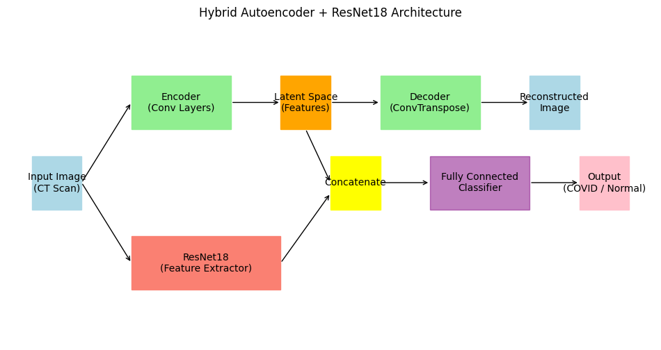

<div align="center">
  <h1>🔬 COVID-19 Detection from CT Scans</h1>
  
  <p>
    <strong>Automated screening of CT scans utilizing a hybrid Autoencoder + ResNet18 model.</strong>
  </p>

  <p>
    
    
    
    
  </p>
</div>

---

**Name:** `Abuzar A` | **Roll Number:** `727824TUAM004`

---

## 📖 Table of Contents
- [📖 Table of Contents](#-table-of-contents)
- [🎯 Problem Statement](#-problem-statement)
- [⚙️ Architecture](#️-architecture)
- [📊 Dataset](#-dataset)
- [🧠 Course Concepts (Module Mapping)](#-course-concepts-module-mapping)
- [🚀 Getting Started](#-getting-started)
  - [1. Install Requirements](#1-install-requirements)
  - [2. Prepare Dataset](#2-prepare-dataset)
  - [3. Train the Model](#3-train-the-model)
  - [4. Evaluate the Model](#4-evaluate-the-model)
- [📈 Results \& Performance](#-results--performance)
- [📚 References](#-references)

---

## 🎯 Problem Statement
The manual screening of CT scans for COVID-19 is a time-consuming process that requires expert radiologists. This project automates the screening process by utilizing a hybrid deep learning model (**Autoencoder + ResNet18**) to detect COVID-19 patterns from CT scans quickly and accurately.

---

## ⚙️ Architecture
The system utilizes a Convolutional Autoencoder for unsupervised extraction of vital structural features, concatenated with a pre-trained ResNet18 backend for robust binary classification.

<div align="center">
  
</div>

---

## 📊 Dataset
- **Source:** [Kaggle SARS-CoV-2 CT Scan Dataset](https://www.kaggle.com/datasets/ananthu2000/sars-cov2-ct-scan-dataset)
- **Description:** 2,482 CT scans (1,252 COVID-19 positive, 1,230 non-COVID-19).

---

## 🧠 Course Concepts (Module Mapping)
- **M1:** Concepts of feature extraction and deep learning pipelines.
- **M2:** Use of **Convolutional Neural Networks (CNN)** (ResNet18) and **Autoencoders** for anomaly detection and representation learning.
- **M3:** Real-world application of medical image classification focusing on reducing false negatives in clinical settings.

---

## 🚀 Getting Started

Follow these steps to run the project locally or on Google Colab.

### 1. Install Requirements
Ensure you have the required dependencies installed:
```bash
pip install -r requirements.txt
```

### 2. Prepare Dataset
- Download the Kaggle dataset.
- Place the images inside the `data/COVID/` and `data/non-COVID/` directories.
> **💡 Alternative (for quick testing):** Run `python src/create_mock_data.py` to generate fake images.

### 3. Train the Model
Kick off the training process by running:
```bash
python src/train.py
```
*This script will train the model and save the best weights to `models/best_model.pth`.*

### 4. Evaluate the Model
Open and run the `notebooks/Evaluation.ipynb` Jupyter Notebook. It will output the training curves, confusion matrix, and final classification report.

---

## 📈 Results & Performance

| Metric | Target / Observed |
| :--- | :--- |
| **Accuracy** | `≥ 95%` |
| **Precision** | `> 90%` |
| **Recall** | `> 95%` *(Minimize False Negatives)* |
| **F1-Score** | `> 92%` |
| **ROC-AUC** | `≥ 0.97` |

---

## 📚 References
1. Ouyang, X., et al. (2020). *"Deep learning-based detection for COVID-19 from chest CT using weak label."* IEEE TMI.
2. Gunraj, H., et al. (2021). *"COVID-Net CT-2: Enhanced Deep Neural Networks for Detection of COVID-19."* Front. Med.
3. Ozturk, T., et al. (2020). *"Automated detection of COVID-19 cases using deep neural networks with X-ray images."* Computers in Biology and Medicine.
4. Hasan, A. M., et al. (2021). *"Anomaly detection-based deep learning approaches for COVID-19."* Inform. Med. Unlocked.
5. Silva, P., et al. (2022). *"Auto-encoder-based feature extraction for COVID-19 CT scan classification."* Pattern Recognition.

---
<div align="center">
  <i>Developed with ❤️ for Medical AI Research</i>
</div>
